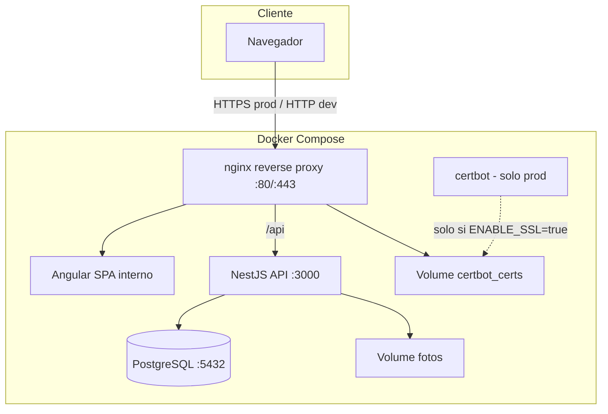
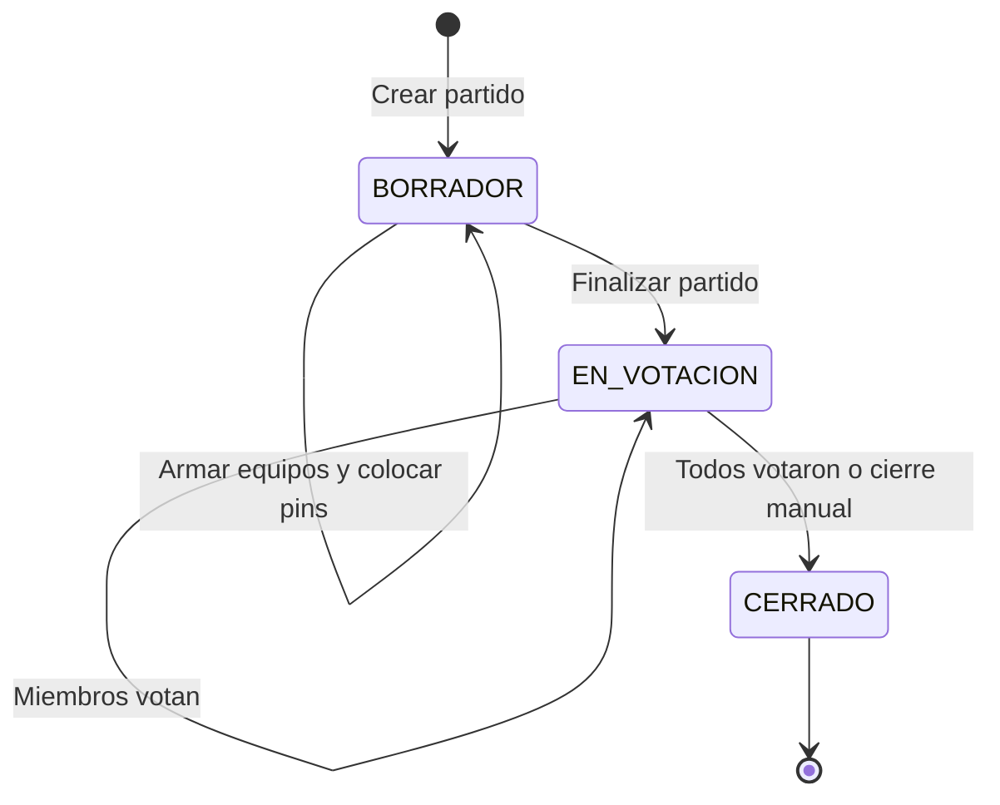

# Plan: FutbolOlvidable — App para equipos amateur

## Contexto

Repositorio vacío. Stack confirmado: **PostgreSQL**, **NestJS** (API), **Angular** (SPA), **Docker Compose**, **nginx** (reverse proxy), **certbot** (SSL en prod). Todos los miembros del grupo tienen permisos iguales; cada grupo define su propio límite de jugadores al crearlo.

Un usuario puede pertenecer a **varios grupos**, pero los puntajes, votaciones y rankings **nunca se mezclan entre grupos**: cada grupo es un universo independiente.

## Arquitectura propuesta



**Estructura del monorepo:**

```
FutbolOlvidable/
├── docker-compose.yml              # dev: sin certbot
├── docker-compose.prod.yml         # overlay prod: SSL + certbot
├── .env.example
├── nginx/
│   ├── Dockerfile
│   ├── nginx.conf
│   ├── conf.d/
│   │   ├── dev.conf                # HTTP, proxy a frontend + /api
│   │   └── futbol-olvidable.archsys.com.conf  # HTTPS prod
│   └── scripts/
│       └── certbot-entrypoint.sh   # no corre si ENABLE_SSL != true
├── backend/          # NestJS
├── frontend/         # Angular
└── README.md
```

| Capa | Tecnología | Rol |
|------|------------|-----|
| Frontend | Angular 19+ (standalone components) | UI, cancha interactiva, votaciones |
| Backend | NestJS + TypeORM | API REST, auth, lógica de negocio |
| DB | PostgreSQL 16 | Persistencia |
| Auth | JWT (access token) + bcrypt | Login por usuario; extensible a OAuth Google |
| Proxy | nginx | Punto de entrada único; HTTP en dev, HTTPS en prod |
| SSL | certbot | Certificados Let's Encrypt solo en prod |
| Fotos | Upload + conversión WebP (`sharp`) → volumen Docker | Fotos de grupo y jugadores optimizadas |

---

## Modelo multi-grupo: puntajes aislados por grupo

### Regla central

> El puntaje de un jugador depende del **grupo**, no del usuario global. Un mismo usuario que juega en 2 grupos tiene **2 perfiles de jugador distintos** (uno por grupo) y por lo tanto **2 puntajes independientes**.

### Cómo se modela

- **`Player` pertenece a un solo `Group`** (`group_id` obligatorio). Es la identidad deportiva dentro de ese grupo.
- Un `User` puede vincularse a **múltiples `Player`** (uno por grupo) vía `user_id` opcional.
- Constraint: `UNIQUE (group_id, user_id)` donde `user_id IS NOT NULL` — un usuario solo puede tener un perfil de jugador por grupo.
- **`Vote`** y **`MvpVote`** cuelgan de `match_id` → `group_id`. Los votos de un grupo nunca afectan rankings de otro.
- **No existe ranking global** ni endpoint cross-group. Toda agregación va bajo `/groups/:id/...`.

### Caso de uso: jugador en 2 grupos

| Grupo | Player (mismo User) | Promedio votos | Partidos |
|-------|---------------------|----------------|----------|
| Los Amigos FC | Player A (user_id=X) | 78 | 5 |
| Martes 20hs | Player B (user_id=X) | 62 | 3 |

El usuario ve en **Mis Grupos** ambos grupos con su puntaje respectivo en cada uno. Dentro de `/groups/:idA/rankings` aparece como Player A; en `/groups/:idB/rankings` como Player B.

---

## Modelo de datos

```mermaid
erDiagram
    User ||--o{ GroupMember : belongs
    Group ||--o{ GroupMember : has
    Group ||--o{ Player : contains
    User ||--o{ Player : "opcional 1 por grupo"
    Group ||--o{ Match : schedules
    Match ||--|{ MatchTeam : has
    MatchTeam ||--o{ MatchLineup : fields
    Player ||--o{ MatchLineup : plays
    User ||--o{ Vote : casts
    Player ||--o{ Vote : receives
    User ||--o{ MvpVote : selects

    User {
        uuid id PK
        string email
        string password_hash nullable
        string display_name
        enum auth_provider
        string provider_id nullable
    }
    Group {
        uuid id PK
        string name
        string photo_url
        int max_players
    }
    Player {
        uuid id PK
        uuid group_id FK
        string name
        string photo_url
        enum default_position
        uuid user_id FK nullable
    }
    Match {
        uuid id PK
        date played_at
        enum status
    }
    MatchLineup {
        float field_x
        float field_y
        enum match_position
    }
    Vote {
        int score
        uuid voter_id
        uuid player_id
    }
```

### Entidades clave

**`users`** — CRUD global de usuarios con login (email + password). Campos adicionales para auth extensible:
- `auth_provider`: `LOCAL` | `GOOGLE` (solo `LOCAL` activo inicialmente)
- `provider_id`: ID externo de Google (nullable, futuro)
- `password_hash`: nullable si auth vía OAuth

**`groups`** — Nombre, foto, `max_players` (definido al crear). Un usuario puede pertenecer a varios grupos.

**`group_members`** — Relación N:M usuario ↔ grupo. Todos los miembros tienen los mismos permisos.

**`players`** — Pertenece a un grupo (`group_id` obligatorio). Campos: nombre, foto, `default_position` (`DELANTERO` | `MEDIO_CAMPO` | `DEFENSOR`). Opcionalmente vinculado a un `user_id` si el jugador tiene cuenta. Constraint `UNIQUE (group_id, user_id)`. Validación: no superar `group.max_players`. El mismo `User` en 2 grupos = 2 registros `Player` distintos con puntajes independientes.

**`matches`** — Pertenece a un grupo. Estados: `BORRADOR` → `EN_VOTACION` → `CERRADO`. Fecha del partido.

**`match_teams`** — Dos equipos por partido (ej. "Equipo A" / "Equipo B"), con nombre y color opcional.

**`match_lineups`** — **Solo jugadores que participaron** en ese partido. Guarda:
- `player_id`, `match_team_id`
- `match_position` (posición real en ese partido)
- `field_x`, `field_y` (coordenadas normalizadas 0–100 en la cancha)

Esto resuelve suplentes y ausencias: si un jugador no está en el lineup, no jugó y no recibe votos ni entra en el ranking de ese partido.

**`votes`** — `voter_id` (usuario), `voted_player_id`, `match_id`, `score` (1–100). Constraint único `(match_id, voter_id, voted_player_id)`. **Inmutable**: sin endpoint de update/delete una vez creada.

**`mvp_votes`** — `voter_id`, `match_id`, `mvp_player_id`. Un MVP por votante por partido. También inmutable.

---

## Reglas de negocio

### Permisos
- Usuario autenticado + miembro del grupo → acceso total al CRUD de ese grupo (jugadores, partidos, votos).
- No miembro → sin acceso.

### Flujo de un partido



1. **Borrador**: seleccionar jugadores de cada equipo (del roster del grupo), colocarlos con pin en la cancha.
2. **En votación**: cualquier miembro del grupo puede votar a **todos los jugadores del lineup** (ambos equipos), excepto a sí mismo si está vinculado como jugador. Score 1–100 + elegir MVP.
3. **Cerrado**: votaciones bloqueadas. Rankings actualizados.

### Votación
- Solo jugadores presentes en `match_lineups` del partido (y por ende del **grupo** del partido) son votables.
- Un votante no puede votarse a sí mismo si su `user_id` coincide con un `player.user_id` del lineup **de ese grupo**.
- Al enviar votos (`POST` batch), quedan fijas. La UI muestra estado "ya votaste" y deshabilita edición.
- Votos solo visibles/modificables dentro del mismo grupo.
- Un usuario miembro de 2 grupos vota **por separado** en cada partido de cada grupo; sus votos en Grupo A no interactúan con Grupo B.

### Rankings
Consultas agregadas **por grupo** sobre partidos `CERRADO` donde el jugador tiene lineup. Sin ranking global cross-group.

| Vista | Cálculo | Scope |
|-------|---------|-------|
| Ranking general | Promedio de `votes.score` por `player_id` | Solo jugadores del grupo |
| Por posición default | Filtro `player.default_position` | Solo jugadores del grupo |
| Por posición en partido | Filtro `match_lineups.match_position` | Solo partidos del grupo |
| MVP | Conteo de apariciones en `mvp_votes` | Solo partidos del grupo |

Métricas adicionales por jugador **dentro del grupo**: partidos jugados, promedio ponderado, mejor partido, tendencia reciente.

**Prohibido**: endpoints tipo `/rankings/global` o agregación que cruce `group_id`.

---

## Autenticación JWT extensible

### Implementación actual (Fase 1)

- **JWT access token** como único mecanismo de sesión.
- Login local: email + password con `bcrypt`.
- `JwtAuthGuard` + decorator `@CurrentUser()` protegen rutas.
- Token emitido por `JwtTokenService` centralizado.

### Estructura del AuthModule

```
backend/src/auth/
├── auth.module.ts
├── auth.controller.ts          # POST /auth/register, /auth/login
├── auth.service.ts             # orquestador: valida credenciales → emite JWT
├── jwt.strategy.ts             # Passport JWT guard (único para todos los providers)
├── strategies/
│   ├── local-auth.strategy.ts  # email + password (implementar)
│   └── google-auth.strategy.ts # stub vacío (NO implementar aún)
├── interfaces/
│   └── auth-provider.interface.ts  # validate(credentials) → User
└── token/
    └── jwt-token.service.ts    # sign/verify centralizado
```

### Extensión futura: OAuth Google (no en scope actual)

Cuando se implemente:

1. Instalar `passport-google-oauth20`.
2. Activar `GoogleAuthStrategy` y rutas `GET /auth/google`, `GET /auth/google/callback`.
3. En callback: buscar/crear User con `auth_provider=GOOGLE`, `provider_id=sub`, emitir mismo JWT.
4. Habilitar botón "Continuar con Google" en Angular (inicialmente oculto/deshabilitado).
5. Descomentar variables `GOOGLE_*` en `.env` de prod.

---

## Módulos NestJS

| Módulo | Responsabilidad |
|--------|-----------------|
| `AuthModule` | Register, login, JWT guard, `@CurrentUser()` decorator; extensible a OAuth |
| `UsersModule` | CRUD usuarios (perfil propio + listado admin básico) |
| `GroupsModule` | CRUD grupos, join/leave, upload foto grupo |
| `PlayersModule` | CRUD jugadores dentro de grupo, validar `max_players`, upload foto |
| `MatchesModule` | CRUD partidos, equipos, lineup con coordenadas, transición de estados |
| `VotesModule` | Enviar votos + MVP (batch atómico), verificar inmutabilidad |
| `RankingsModule` | Queries agregadas por grupo con filtros por posición |
| `UploadModule` | Multer + `sharp`: recibe JPG/PNG, convierte a WebP y guarda en `/uploads/{groups\|players}/` |

**Endpoints principales (REST):**

```
POST   /auth/register | /auth/login
GET/PUT/DELETE  /users/:id
GET    /users/me/groups                          # mis grupos con resumen de stats
GET/POST/PUT/DELETE  /groups                     # GET lista grupos del usuario autenticado
POST   /groups/:id/join
GET/POST/PUT/DELETE  /groups/:id/players
GET    /groups/:id/players/:playerId/stats       # stats del jugador en ese grupo
GET/POST/PUT/DELETE  /groups/:id/matches
PUT    /groups/:id/matches/:matchId/lineup
PATCH  /groups/:id/matches/:matchId/status
POST   /groups/:id/matches/:matchId/votes        # batch, inmutable
GET    /groups/:id/rankings?position=&type=default|match
POST   /upload
```

### Almacenamiento de imágenes en WebP

Todas las fotos (grupos y jugadores) se guardan en formato **WebP** para optimizar espacio en disco.

**Flujo de upload:**

1. El cliente envía la imagen en cualquier formato común (JPEG, PNG, WebP).
2. El backend valida tipo MIME y tamaño máximo (ej. 5 MB).
3. `sharp` convierte la imagen a WebP con calidad configurable (ej. `quality: 80`).
4. Se redimensiona si supera dimensiones máximas (ej. 800×800 px) manteniendo aspect ratio.
5. Se guarda como `{uuid}.webp` en el volumen Docker.
6. En la base de datos solo se persiste la URL/ruta (ej. `/uploads/groups/abc123.webp`).

**Configuración en `.env`:**

```
DATABASE_URL=
JWT_SECRET=
JWT_EXPIRES_IN=7d
UPLOAD_PATH=/app/uploads
UPLOAD_MAX_SIZE_MB=5
UPLOAD_WEBP_QUALITY=80
UPLOAD_MAX_WIDTH=800
UPLOAD_MAX_HEIGHT=800
# OAuth Google (futuro — no implementar aún)
# GOOGLE_CLIENT_ID=
# GOOGLE_CLIENT_SECRET=
# GOOGLE_CALLBACK_URL=https://futbol-olvidable.archsys.com/api/auth/google/callback
# SSL (solo prod)
ENABLE_SSL=false
DOMAIN=futbol-olvidable.archsys.com
CERTBOT_EMAIL=
```

**Librería:** [`sharp`](https://sharp.pixelplumbing.com/) — procesamiento de imágenes en Node.js, rápido y con soporte nativo de WebP.

---

## Frontend Angular

### Rutas principales

| Ruta | Pantalla |
|------|----------|
| `/login`, `/register` | Autenticación (botón Google oculto/deshabilitado como placeholder) |
| `/groups` | **Mis Grupos** — tarjetas con puntaje resumido por grupo |
| `/groups/:id` | Detalle: jugadores, partidos, ranking (contexto aislado del grupo) |
| `/groups/:id/players` | CRUD jugadores + foto + posición default |
| `/groups/:id/players/:playerId` | Ficha de jugador con stats solo de ese grupo |
| `/groups/:id/matches/new` | Crear partido |
| `/groups/:id/matches/:id/setup` | **Cancha interactiva** — drag & drop pins |
| `/groups/:id/matches/:id/vote` | Formulario de votación + MVP |
| `/groups/:id/rankings` | Tabla de rankings con filtros |

### Componente crítico: `FieldCanvasComponent`

- SVG o Canvas con imagen de cancha de fútbol.
- Cada jugador seleccionado aparece como pin arrastrable.
- Al soltar: guarda `(field_x, field_y)` normalizados y permite elegir `match_position`.
- Validación: mínimo 1 jugador por equipo para pasar a votación.

### Servicios Angular
- `AuthService` — JWT access token en `localStorage`, interceptor `Authorization: Bearer <token>`.
- `GroupsService`, `PlayersService`, `MatchesService`, `VotesService`, `RankingsService`.

---

## Docker Compose

### Desarrollo (`docker-compose.yml`)

```yaml
services:
  postgres:
    image: postgres:16
    volumes: [pgdata:/var/lib/postgresql/data]
    environment: POSTGRES_DB, POSTGRES_USER, POSTGRES_PASSWORD
    ports: ["5432:5432"]   # expuesto al host para acceso externo (DBeaver, pgAdmin, etc.)

  api:
    build: ./backend
    depends_on: [postgres]
    volumes: [uploads:/app/uploads]
    # no expuesto al host; accesible vía nginx en /api

  frontend:
    build: ./frontend
    depends_on: [api]
    # no expuesto al host; accesible vía nginx

  nginx:
    build: ./nginx
    depends_on: [frontend, api]
    ports: ["80:80"]
```

### Producción (`docker-compose.prod.yml` — overlay)

```yaml
services:
  nginx:
    ports: ["80:80", "443:443"]
    volumes: [certbot_certs:/etc/letsencrypt, certbot_www:/var/www/certbot]

  certbot:
    image: certbot/certbot
    volumes: [certbot_certs:/etc/letsencrypt, certbot_www:/var/www/certbot]
    entrypoint: /scripts/certbot-entrypoint.sh
    environment:
      ENABLE_SSL: "true"
      DOMAIN: futbol-olvidable.archsys.com
```

**Comandos:**

| Entorno | Comando |
|---------|---------|
| Dev | `docker compose up` |
| Prod | `docker compose -f docker-compose.yml -f docker-compose.prod.yml up` |

- Migraciones TypeORM al iniciar API en dev.
- Dominio prod: **`futbol-olvidable.archsys.com`**.

### Nginx + Certbot (prod condicional)

**nginx** (`nginx/`):
- `dev.conf`: `server_name _;` en puerto 80, `proxy_pass` a `frontend:80` y `location /api` → `api:3000`.
- `futbol-olvidable.archsys.com.conf`: bloque HTTP (ACME challenge en `/.well-known/acme-challenge/`) + bloque HTTPS con certs de Let's Encrypt. Solo se incluye cuando `ENABLE_SSL=true`.

**certbot** — script `certbot-entrypoint.sh`:

```bash
if [ "$ENABLE_SSL" != "true" ]; then
  echo "ENABLE_SSL is not true — skipping certificate generation"
  exit 0
fi
# certbot certonly --webroot ... -d futbol-olvidable.archsys.com
```

- En dev: el servicio `certbot` **no se levanta** (overlay prod) o arranca y sale inmediatamente sin error.
- En prod: primer arranque genera cert; renovación vía cron/sidecar documentado en README.

### Acceso externo a PostgreSQL

El puerto `5432` se mapea al host (`localhost:5432`) para poder conectarse desde herramientas fuera del contenedor (DBeaver, pgAdmin, `psql`, etc.).

**Conexión desde el host:**

| Campo | Valor |
|-------|-------|
| Host | `localhost` |
| Puerto | `5432` |
| Base de datos | `futbol_olvidable` (configurable en `.env`) |
| Usuario | `postgres` (configurable en `.env`) |
| Password | definido en `.env` / `docker-compose.yml` |

> Solo para desarrollo local. En producción no exponer el puerto de PostgreSQL al exterior.

### Usuario semilla (seed)

Al iniciar la API por primera vez (o mediante script de seed), se crea automáticamente un usuario de prueba en la base de datos:

| Campo | Valor |
|-------|-------|
| Email | `admin@futbol.local` |
| Password | `Admin123!` |
| Nombre | `Admin Demo` |
| auth_provider | `LOCAL` |

**Implementación en NestJS:**

- Script `backend/src/database/seeds/seed.ts` ejecutado con `npm run seed`.
- Usa `bcrypt` para hashear la contraseña (misma lógica que registro).
- Verifica si el usuario ya existe antes de insertar (idempotente: no duplica en reinicios).
- Se ejecuta automáticamente al levantar con `docker compose up` en entorno de desarrollo, o manualmente con `docker compose exec api npm run seed`.

Credenciales documentadas en el `README.md` para facilitar el primer login.

---

## Fases de implementación

### Fase 1 — Fundación (semana 1)
- [x] Scaffold monorepo: NestJS + Angular + Docker Compose + PostgreSQL + nginx.
- [x] `docker-compose.yml` (dev) y `docker-compose.prod.yml` (overlay SSL).
- [x] nginx reverse proxy: HTTP en dev, HTTPS en prod para `futbol-olvidable.archsys.com`.
- [x] certbot condicional: no intenta generar certs si `ENABLE_SSL=false`.
- [x] PostgreSQL con puerto `5432:5432` expuesto al host para acceso externo.
- [x] Entidad `User` con `auth_provider`/`provider_id`, migraciones, `AuthModule` (register/login/JWT extensible).
- [x] Patrón Strategy: `LocalAuthStrategy` + stub `GoogleAuthStrategy`.
- [x] Script de seed: usuario semilla `admin@futbol.local` / `Admin123!` (idempotente).
- [x] CRUD básico de usuarios.
- [x] Angular: login, register, layout base, guard de rutas, interceptor JWT.

### Fase 2 — Grupos y jugadores (semana 2)
- [x] Entidades `Group`, `GroupMember`, `Player` con `group_id` y `UNIQUE (group_id, user_id)`.
- [x] `UploadModule` con conversión automática a WebP vía `sharp` (resize + compresión).
- [x] CRUD grupos con `max_players` y foto.
- [x] CRUD jugadores con posición default y foto.
- [x] `GET /groups` y `GET /users/me/groups` con resumen de stats.
- [x] Angular: **Mis Grupos** con tarjetas y puntaje por grupo; CRUD jugadores con preview de imagen.

### Fase 3 — Partidos y cancha (semana 3)
- [x] Entidades `Match`, `MatchTeam`, `MatchLineup`.
- [x] Flujo borrador: armar equipos, colocar pins, guardar coordenadas.
- [x] Componente `FieldCanvasComponent` en Angular.
- [x] Transición de estado del partido.

### Fase 4 — Votaciones (semana 4)
- [x] Entidades `Vote`, `MvpVote` con constraints de inmutabilidad.
- [x] Endpoint batch de votación scoped al grupo con validaciones.
- [x] UI de votación: sliders 1–100, selector MVP, confirmación irreversible.

### Fase 5 — Rankings (semana 5)
- [x] Queries agregadas en `RankingsModule` **por grupo** (sin ranking global).
- [x] `GET /groups/:id/players/:playerId/stats`.
- [x] Filtros por posición default vs posición en partido.
- [x] Dashboard de estadísticas por jugador dentro del grupo.
- [x] Mis Grupos muestra puntajes distintos por grupo.

### Fase 6 — Pulido
- [x] Manejo de errores, loading states, validaciones de formulario.
- [x] Seed data extendido para demo (grupo, jugadores, partido de ejemplo).
- [x] README con instrucciones dev/prod, credenciales semilla, conexión PostgreSQL, renovación SSL.

---

## Decisiones técnicas asumidas

- **JWT access token** — único mecanismo de sesión; emitido por `JwtTokenService` sin importar el proveedor de login.
- **Auth extensible (OAuth Google)** — patrón Strategy + `auth_provider`/`provider_id` en User; stub de Google sin implementar; variables `GOOGLE_*` preparadas en `.env.example`.
- **nginx reverse proxy** — punto de entrada único; en dev solo HTTP; en prod HTTPS para `futbol-olvidable.archsys.com`.
- **Certbot condicional** — solo corre con `ENABLE_SSL=true` en overlay prod; en dev no se levanta ni intenta generar certs.
- **Aislamiento por grupo** — `Player`, votos, partidos y rankings siempre scoped a `group_id`; un `User` multi-grupo tiene un `Player` (y puntaje) distinto por grupo; sin ranking global.
- **PostgreSQL expuesto en dev**: puerto `5432` mapeado al host para debugging y herramientas externas; no exponer en producción.
- **Usuario semilla idempotente**: creado al iniciar en dev para poder loguearse de inmediato sin registrarse manualmente.
- **Imágenes en WebP**: todo upload se convierte a WebP con `sharp` antes de guardar; el cliente puede enviar JPG/PNG pero el almacenamiento siempre es `.webp`.
- **TypeORM** sobre Prisma (integración nativa con NestJS).
- **Coordenadas normalizadas** (0–100) para que la cancha sea responsive en cualquier pantalla.
- **Votación batch**: el usuario envía todas sus votaciones + MVP en un solo submit (más simple y atómico).
- **Cierre de votación**: automático cuando todos los miembros del grupo votaron, con opción de cierre manual por cualquier miembro.
- **Jugador ↔ Usuario**: relación opcional; un miembro del grupo puede votar aunque no esté registrado como jugador en el roster.

## Riesgos y mitigaciones

| Riesgo | Mitigación |
|--------|------------|
| Certbot falla en dev sin dominio | `ENABLE_SSL=false` + servicio certbot solo en overlay prod |
| Refactor al agregar OAuth | Strategy pattern + JWT centralizado desde Fase 1 |
| Confusión multi-grupo | `Player` por grupo + Mis Grupos con stats separadas; sin endpoints globales |
| Cancha compleja en mobile | Coordenadas normalizadas + touch events; vista responsive |
| Votos parciales | Batch submit: todo o nada por votante |
| Rankings sesgados por pocos partidos | Mostrar "partidos jugados" junto al promedio |
| Fotos grandes | Conversión WebP + resize automático en upload; límite de 5 MB en request |
