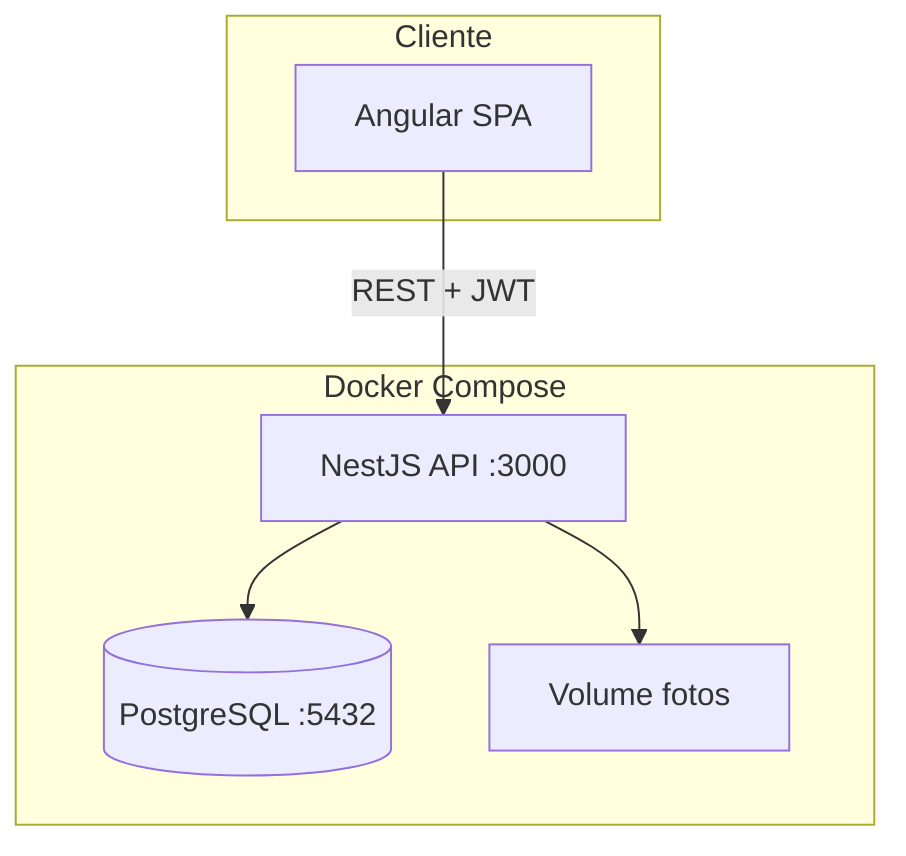
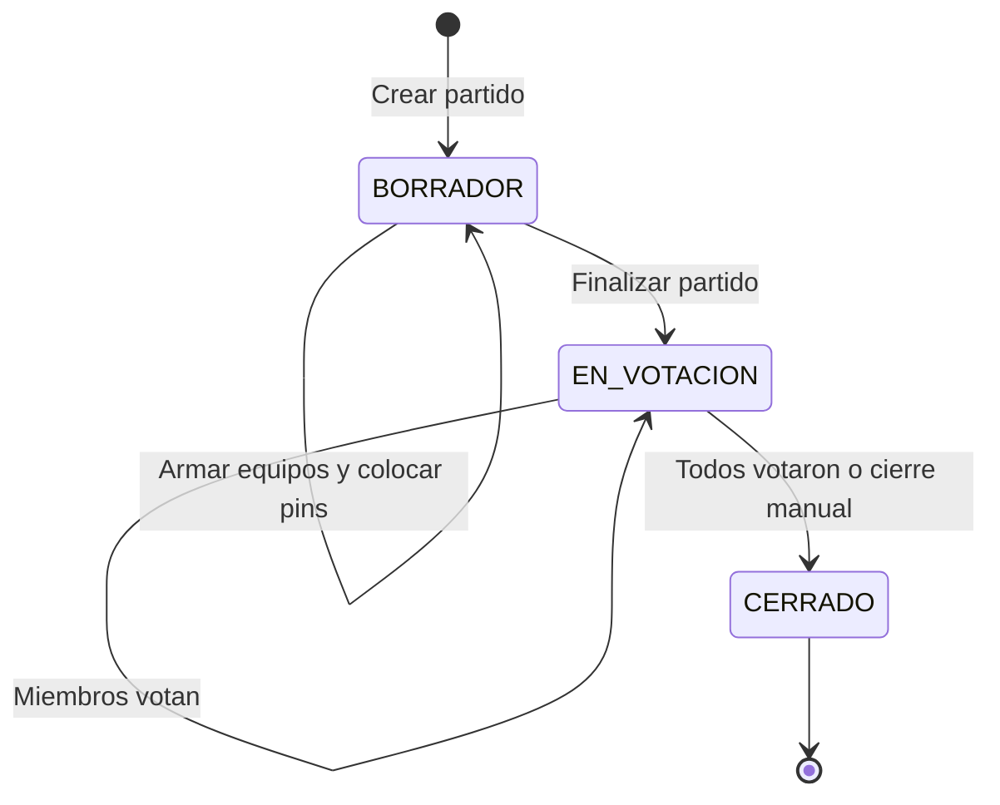

# Plan: FutbolOlvidable — App para equipos amateur

## Contexto

Repositorio vacío. Stack confirmado: **PostgreSQL**, **NestJS** (API), **Angular** (SPA), **Docker Compose**. Todos los miembros del grupo tienen permisos iguales; cada grupo define su propio límite de jugadores al crearlo.

## Arquitectura propuesta



**Estructura del monorepo:**

```
FutbolOlvidable/
├── docker-compose.yml
├── backend/          # NestJS
├── frontend/         # Angular
└── README.md
```

| Capa | Tecnología | Rol |
|------|------------|-----|
| Frontend | Angular 19+ (standalone components) | UI, cancha interactiva, votaciones |
| Backend | NestJS + TypeORM | API REST, auth, lógica de negocio |
| DB | PostgreSQL 16 | Persistencia |
| Auth | JWT (access token) + bcrypt | Login por usuario |
| Fotos | Upload + conversión WebP (`sharp`) → volumen Docker | Fotos de grupo y jugadores optimizadas |

---

## Modelo de datos

```mermaid
erDiagram
    User ||--o{ GroupMember : belongs
    Group ||--o{ GroupMember : has
    Group ||--o{ Player : contains
    Group ||--o{ Match : schedules
    Match ||--|{ MatchTeam : has
    MatchTeam ||--o{ MatchLineup : fields
    Player ||--o{ MatchLineup : plays
    User ||--o{ Vote : casts
    Player ||--o{ Vote : receives
    User ||--o{ MvpVote : selects

    User {
        uuid id PK
        string email
        string password_hash
        string display_name
    }
    Group {
        uuid id PK
        string name
        string photo_url
        int max_players
    }
    Player {
        uuid id PK
        string name
        string photo_url
        enum default_position
        uuid user_id FK nullable
    }
    Match {
        uuid id PK
        date played_at
        enum status
    }
    MatchLineup {
        float field_x
        float field_y
        enum match_position
    }
    Vote {
        int score
        uuid voter_id
        uuid player_id
    }
```

### Entidades clave

**`users`** — CRUD global de usuarios con login (email + password).

**`groups`** — Nombre, foto, `max_players` (definido al crear). Un usuario puede pertenecer a varios grupos.

**`group_members`** — Relación N:M usuario ↔ grupo. Todos los miembros tienen los mismos permisos.

**`players`** — Pertenece a un grupo. Campos: nombre, foto, `default_position` (`DELANTERO` | `MEDIO_CAMPO` | `DEFENSOR`). Opcionalmente vinculado a un `user_id` si el jugador tiene cuenta. Validación: no superar `group.max_players`.

**`matches`** — Pertenece a un grupo. Estados: `BORRADOR` → `EN_VOTACION` → `CERRADO`. Fecha del partido.

**`match_teams`** — Dos equipos por partido (ej. "Equipo A" / "Equipo B"), con nombre y color opcional.

**`match_lineups`** — **Solo jugadores que participaron** en ese partido. Guarda:
- `player_id`, `match_team_id`
- `match_position` (posición real en ese partido)
- `field_x`, `field_y` (coordenadas normalizadas 0–100 en la cancha)

Esto resuelve suplentes y ausencias: si un jugador no está en el lineup, no jugó y no recibe votos ni entra en el ranking de ese partido.

**`votes`** — `voter_id` (usuario), `voted_player_id`, `match_id`, `score` (1–100). Constraint único `(match_id, voter_id, voted_player_id)`. **Inmutable**: sin endpoint de update/delete una vez creada.

**`mvp_votes`** — `voter_id`, `match_id`, `mvp_player_id`. Un MVP por votante por partido. También inmutable.

---

## Reglas de negocio

### Permisos
- Usuario autenticado + miembro del grupo → acceso total al CRUD de ese grupo (jugadores, partidos, votos).
- No miembro → sin acceso.

### Flujo de un partido



1. **Borrador**: seleccionar jugadores de cada equipo (del roster del grupo), colocarlos con pin en la cancha.
2. **En votación**: cualquier miembro del grupo puede votar a **todos los jugadores del lineup** (ambos equipos), excepto a sí mismo si está vinculado como jugador. Score 1–100 + elegir MVP.
3. **Cerrado**: votaciones bloqueadas. Rankings actualizados.

### Votación
- Solo jugadores presentes en `match_lineups` son votables.
- Un votante no puede votarse a sí mismo (si su `user_id` coincide con un `player.user_id` del lineup).
- Al enviar votos (`POST` batch), quedan fijas. La UI muestra estado "ya votaste" y deshabilita edición.
- Votos solo visibles/modificables dentro del mismo grupo.

### Rankings
Consultas agregadas sobre partidos `CERRADO` donde el jugador tiene lineup:

| Vista | Cálculo |
|-------|---------|
| Ranking general | Promedio de `votes.score` por jugador |
| Por posición default | Filtro `player.default_position` |
| Por posición en partido | Filtro `match_lineups.match_position` |
| MVP | Conteo de apariciones en `mvp_votes` |

Métricas adicionales útiles: partidos jugados, promedio ponderado, mejor partido, tendencia reciente.

---

## Módulos NestJS

| Módulo | Responsabilidad |
|--------|-----------------|
| `AuthModule` | Register, login, JWT guard, `@CurrentUser()` decorator |
| `UsersModule` | CRUD usuarios (perfil propio + listado admin básico) |
| `GroupsModule` | CRUD grupos, join/leave, upload foto grupo |
| `PlayersModule` | CRUD jugadores dentro de grupo, validar `max_players`, upload foto |
| `MatchesModule` | CRUD partidos, equipos, lineup con coordenadas, transición de estados |
| `VotesModule` | Enviar votos + MVP (batch atómico), verificar inmutabilidad |
| `RankingsModule` | Queries agregadas con filtros por posición |
| `UploadModule` | Multer + `sharp`: recibe JPG/PNG, convierte a WebP y guarda en `/uploads/{groups\|players}/` |

**Endpoints principales (REST):**

```
POST   /auth/register | /auth/login
GET/PUT/DELETE  /users/:id
GET/POST/PUT/DELETE  /groups
POST   /groups/:id/join
GET/POST/PUT/DELETE  /groups/:id/players
GET/POST/PUT/DELETE  /groups/:id/matches
PUT    /groups/:id/matches/:matchId/lineup
PATCH  /groups/:id/matches/:matchId/status
POST   /groups/:id/matches/:matchId/votes        # batch, inmutable
GET    /groups/:id/rankings?position=&type=default|match
POST   /upload
```

### Almacenamiento de imágenes en WebP

Todas las fotos (grupos y jugadores) se guardan en formato **WebP** para optimizar espacio en disco.

**Flujo de upload:**

1. El cliente envía la imagen en cualquier formato común (JPEG, PNG, WebP).
2. El backend valida tipo MIME y tamaño máximo (ej. 5 MB).
3. `sharp` convierte la imagen a WebP con calidad configurable (ej. `quality: 80`).
4. Se redimensiona si supera dimensiones máximas (ej. 800×800 px) manteniendo aspect ratio.
5. Se guarda como `{uuid}.webp` en el volumen Docker.
6. En la base de datos solo se persiste la URL/ruta (ej. `/uploads/groups/abc123.webp`).

**Configuración en `.env`:**

```
UPLOAD_MAX_SIZE_MB=5
UPLOAD_WEBP_QUALITY=80
UPLOAD_MAX_WIDTH=800
UPLOAD_MAX_HEIGHT=800
```

**Librería:** [`sharp`](https://sharp.pixelplumbing.com/) — procesamiento de imágenes en Node.js, rápido y con soporte nativo de WebP.

---

## Frontend Angular

### Rutas principales

| Ruta | Pantalla |
|------|----------|
| `/login`, `/register` | Autenticación |
| `/groups` | Mis grupos |
| `/groups/:id` | Detalle: jugadores, partidos, ranking |
| `/groups/:id/players` | CRUD jugadores + foto + posición default |
| `/groups/:id/matches/new` | Crear partido |
| `/groups/:id/matches/:id/setup` | **Cancha interactiva** — drag & drop pins |
| `/groups/:id/matches/:id/vote` | Formulario de votación + MVP |
| `/groups/:id/rankings` | Tabla de rankings con filtros |

### Componente crítico: `FieldCanvasComponent`

- SVG o Canvas con imagen de cancha de fútbol.
- Cada jugador seleccionado aparece como pin arrastrable.
- Al soltar: guarda `(field_x, field_y)` normalizados y permite elegir `match_position`.
- Validación: mínimo 1 jugador por equipo para pasar a votación.

### Servicios Angular
- `AuthService` — token en `localStorage`, interceptor JWT.
- `GroupsService`, `PlayersService`, `MatchesService`, `VotesService`, `RankingsService`.

---

## Docker Compose

```yaml
services:
  postgres:
    image: postgres:16
    volumes: [pgdata:/var/lib/postgresql/data]
    environment: POSTGRES_DB, POSTGRES_USER, POSTGRES_PASSWORD
    ports: ["5432:5432"]   # expuesto al host para acceso externo (DBeaver, pgAdmin, etc.)

  api:
    build: ./backend
    depends_on: [postgres]
    volumes: [uploads:/app/uploads]
    ports: ["3000:3000"]

  frontend:
    build: ./frontend
    depends_on: [api]
    ports: ["4200:80"]   # nginx sirve build de Angular
```

- Migraciones TypeORM al iniciar API en dev.
- Variables de entorno: `DATABASE_URL`, `JWT_SECRET`, `UPLOAD_PATH`.

### Acceso externo a PostgreSQL

El puerto `5432` se mapea al host (`localhost:5432`) para poder conectarse desde herramientas fuera del contenedor (DBeaver, pgAdmin, `psql`, etc.).

**Conexión desde el host:**

| Campo | Valor |
|-------|-------|
| Host | `localhost` |
| Puerto | `5432` |
| Base de datos | `futbol_olvidable` (configurable en `.env`) |
| Usuario | `postgres` (configurable en `.env`) |
| Password | definido en `.env` / `docker-compose.yml` |

> Solo para desarrollo local. En producción no exponer el puerto de PostgreSQL al exterior.

### Usuario semilla (seed)

Al iniciar la API por primera vez (o mediante script de seed), se crea automáticamente un usuario de prueba en la base de datos:

| Campo | Valor |
|-------|-------|
| Email | `admin@futbol.local` |
| Password | `Admin123!` |
| Nombre | `Admin Demo` |

**Implementación en NestJS:**

- Script `backend/src/database/seeds/seed.ts` ejecutado con `npm run seed`.
- Usa `bcrypt` para hashear la contraseña (misma lógica que registro).
- Verifica si el usuario ya existe antes de insertar (idempotente: no duplica en reinicios).
- Se ejecuta automáticamente al levantar con `docker compose up` en entorno de desarrollo, o manualmente con `docker compose exec api npm run seed`.

Credenciales documentadas en el `README.md` para facilitar el primer login.

---

## Fases de implementación

### Fase 1 — Fundación (semana 1)
- [ ] Scaffold monorepo: NestJS + Angular + Docker Compose + PostgreSQL.
- [ ] PostgreSQL con puerto `5432:5432` expuesto al host para acceso externo.
- [ ] Entidades `User`, migraciones, `AuthModule` (register/login/JWT).
- [ ] Script de seed: usuario semilla `admin@futbol.local` / `Admin123!` (idempotente).
- [ ] CRUD básico de usuarios.
- [ ] Angular: login, register, layout base, guard de rutas.

### Fase 2 — Grupos y jugadores (semana 2)
- [ ] Entidades `Group`, `GroupMember`, `Player`.
- [ ] `UploadModule` con conversión automática a WebP vía `sharp` (resize + compresión).
- [ ] CRUD grupos con `max_players` y foto.
- [ ] CRUD jugadores con posición default y foto.
- [ ] Angular: pantallas de grupos y jugadores con preview de imagen.

### Fase 3 — Partidos y cancha (semana 3)
- [ ] Entidades `Match`, `MatchTeam`, `MatchLineup`.
- [ ] Flujo borrador: armar equipos, colocar pins, guardar coordenadas.
- [ ] Componente `FieldCanvasComponent` en Angular.
- [ ] Transición de estado del partido.

### Fase 4 — Votaciones (semana 4)
- [ ] Entidades `Vote`, `MvpVote` con constraints de inmutabilidad.
- [ ] Endpoint batch de votación con validaciones.
- [ ] UI de votación: sliders 1–100, selector MVP, confirmación irreversible.

### Fase 5 — Rankings (semana 5)
- [ ] Queries agregadas en `RankingsModule`.
- [ ] Filtros por posición default vs posición en partido.
- [ ] Dashboard de estadísticas por jugador.

### Fase 6 — Pulido
- [ ] Manejo de errores, loading states, validaciones de formulario.
- [ ] Seed data extendido para demo (grupo, jugadores, partido de ejemplo).
- [ ] README con instrucciones `docker compose up`, credenciales del usuario semilla y conexión a PostgreSQL.

---

## Decisiones técnicas asumidas

- **PostgreSQL expuesto en dev**: puerto `5432` mapeado al host para debugging y herramientas externas; no exponer en producción.
- **Usuario semilla idempotente**: creado al iniciar en dev para poder loguearse de inmediato sin registrarse manualmente.
- **Imágenes en WebP**: todo upload se convierte a WebP con `sharp` antes de guardar; el cliente puede enviar JPG/PNG pero el almacenamiento siempre es `.webp`.
- **TypeORM** sobre Prisma (integración nativa con NestJS).
- **Coordenadas normalizadas** (0–100) para que la cancha sea responsive en cualquier pantalla.
- **Votación batch**: el usuario envía todas sus votaciones + MVP en un solo submit (más simple y atómico).
- **Cierre de votación**: automático cuando todos los miembros votaron, con opción de cierre manual por cualquier miembro.
- **Jugador ↔ Usuario**: relación opcional; un miembro del grupo puede votar aunque no esté registrado como jugador en el roster.

## Riesgos y mitigaciones

| Riesgo | Mitigación |
|--------|------------|
| Cancha compleja en mobile | Coordenadas normalizadas + touch events; vista responsive |
| Votos parciales | Batch submit: todo o nada por votante |
| Rankings sesgados por pocos partidos | Mostrar "partidos jugados" junto al promedio |
| Fotos grandes | Conversión WebP + resize automático en upload; límite de 5 MB en request |
